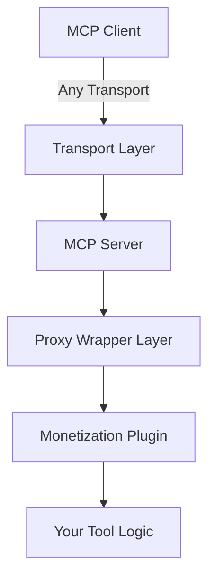

# MCP Transport Compatibility Guide

## Overview

The MCP Stripe Monetization Plugin is **completely transport-agnostic** and works with all Model Context Protocol transport methods. This document demonstrates how to use our monetization with different transport protocols.

---

## 🎯 Why Transport-Agnostic?

Our monetization plugin works at the **server application layer**, not the transport layer:



**Key Benefits:**
- ✅ Same monetization code works everywhere
- ✅ No transport-specific configuration needed
- ✅ Easy to switch between deployment methods
- ✅ Unified billing regardless of connection method

---

## 📡 Transport Method Examples

### 1. STDIO Transport (CLI Applications)

Most common for command-line tools and process-based communication.

```typescript
// server-stdio.ts
import { McpServer } from '@modelcontextprotocol/sdk/server/mcp.js';
import { StdioServerTransport } from '@modelcontextprotocol/sdk/server/stdio.js';
import { wrapWithProxy } from 'mcp-proxy-wrapper';
import { createStripeMonetizationPlugin, createBasicSetup } from 'mcp-stripe-monetization';

// 1. Create server
const server = new McpServer({
  name: 'CLI AI Tools',
  version: '1.0.0'
});

// 2. Add monetization
const plugin = createStripeMonetizationPlugin(createBasicSetup({
  stripeSecretKey: process.env.STRIPE_SECRET_KEY!,
  stripePublishableKey: process.env.STRIPE_PUBLISHABLE_KEY!,
  webhookSecret: process.env.STRIPE_WEBHOOK_SECRET!,
  defaultPrice: 100 // $1.00 per call
}));

const proxiedServer = await wrapWithProxy(server, {
  plugins: [plugin]
});

// 3. Register monetized tools
proxiedServer.tool('ai-analysis', {
  text: z.string()
}, async (args) => {
  return { content: [{ type: 'text', text: `Analysis: ${args.text}` }] };
});

// 4. Connect with STDIO transport
const transport = new StdioServerTransport();
await proxiedServer.connect(transport);

console.log('💰 Monetized MCP server running on STDIO');
```

**Usage:**
```bash
# Run the server
node server-stdio.js

# Client connects via STDIO
echo '{"method":"tools/call","params":{"name":"ai-analysis","arguments":{"text":"hello"}}}' | node server-stdio.js
```

---

### 2. SSE Transport (Web Applications)

Server-Sent Events for real-time web applications.

```typescript
// server-sse.ts
import { McpServer } from '@modelcontextprotocol/sdk/server/mcp.js';
import { SSEServerTransport } from '@modelcontextprotocol/sdk/server/sse.js';
import { createStripeMonetizationPlugin } from 'mcp-stripe-monetization';
import express from 'express';

const app = express();

// 1. Create monetized server (same as STDIO!)
const server = new McpServer({
  name: 'Web AI Tools',
  version: '1.0.0'
});

const plugin = createStripeMonetizationPlugin(config);
const proxiedServer = await wrapWithProxy(server, {
  plugins: [plugin]
});

// Same tool registration as STDIO
proxiedServer.tool('ai-analysis', schema, handler);

// 2. Setup SSE transport
const transport = new SSEServerTransport('/api/sse', server);

// 3. Mount SSE endpoints  
app.use('/api/sse', transport.createHandler());

// 4. Add payment endpoints (same code as before!)
const stripeEndpoints = plugin.getStripeEndpoints();
const stripeRoutes = createStripeRoutes(stripeEndpoints);

app.post('/api/stripe/checkout', stripeRoutes.createCheckout);
app.post('/api/stripe/portal', stripeRoutes.createPortal);

app.listen(3000, () => {
  console.log('💰 Monetized MCP server running on SSE at http://localhost:3000');
});
```

**Frontend Integration:**
```typescript
// client-sse.ts
import { Client } from '@modelcontextprotocol/sdk/client/index.js';
import { SSEClientTransport } from '@modelcontextprotocol/sdk/client/sse.js';

const client = new Client({
  name: 'Web Client',
  version: '1.0.0'
}, { capabilities: {} });

const transport = new SSEClientTransport(
  new URL('http://localhost:3000/api/sse')
);

await client.connect(transport);

// Tool calls work the same way!
try {
  const result = await client.callTool({
    name: 'ai-analysis',
    arguments: { text: 'analyze this' }
  });
  console.log('Result:', result);
} catch (error) {
  if (error.code === -32001) { // Payment required
    window.location.href = '/checkout';
  }
}
```

---

### 3. WebSocket Transport (Real-time Applications)

Full-duplex communication for interactive applications.

```typescript
// server-websocket.ts
import { McpServer } from '@modelcontextprotocol/sdk/server/mcp.js';
import { WebSocketServerTransport } from '@modelcontextprotocol/sdk/server/websocket.js';
import { createStripeMonetizationPlugin } from 'mcp-stripe-monetization';
import { WebSocketServer } from 'ws';

// 1. Create monetized server (identical setup!)
const server = new McpServer({
  name: 'WebSocket AI Tools',
  version: '1.0.0'
});

const plugin = createStripeMonetizationPlugin(config);
const proxiedServer = await wrapWithProxy(server, {
  plugins: [plugin]
});

// Same tool registration
proxiedServer.tool('real-time-chat', {
  message: z.string(),
  context: z.array(z.string()).optional()
}, async (args) => {
  // Real-time AI chat logic
  const response = await processChat(args.message, args.context);
  return { content: [{ type: 'text', text: response }] };
});

// 2. Setup WebSocket server
const wss = new WebSocketServer({ port: 8080 });

wss.on('connection', async (ws) => {
  const transport = new WebSocketServerTransport(ws);
  await proxiedServer.connect(transport);
  
  console.log('💰 New monetized WebSocket connection');
});

console.log('💰 Monetized WebSocket MCP server running on ws://localhost:8080');
```

**Client Usage:**
```typescript
// client-websocket.ts
import { Client } from '@modelcontextprotocol/sdk/client/index.js';
import { WebSocketClientTransport } from '@modelcontextprotocol/sdk/client/websocket.js';

const client = new Client({
  name: 'WebSocket Client',
  version: '1.0.0'
}, { capabilities: {} });

const transport = new WebSocketClientTransport(
  new URL('ws://localhost:8080')
);

await client.connect(transport);

// Real-time chat with billing
const chatWithBilling = async (message: string) => {
  try {
    const result = await client.callTool({
      name: 'real-time-chat',
      arguments: { message }
    });
    return result.content[0].text;
  } catch (error) {
    if (error.code === -32001) {
      // Payment required - redirect to checkout
      showPaymentModal();
    }
    throw error;
  }
};
```

---

### 4. HTTP Transport (REST-like APIs)

Standard HTTP request/response pattern.

```typescript
// server-http.ts
import { McpServer } from '@modelcontextprotocol/sdk/server/mcp.js';
import { createStripeMonetizationPlugin } from 'mcp-stripe-monetization';
import express from 'express';

const app = express();
app.use(express.json());

// 1. Create monetized server (same setup!)
const server = new McpServer({
  name: 'HTTP AI Tools',
  version: '1.0.0'
});

const plugin = createStripeMonetizationPlugin(config);
const proxiedServer = await wrapWithProxy(server, {
  plugins: [plugin]
});

// Same tool registration
proxiedServer.tool('api-analysis', schema, handler);

// 2. Create HTTP wrapper for MCP calls
app.post('/api/mcp/call-tool', async (req, res) => {
  const { toolName, arguments: args, userId } = req.body;
  
  try {
    // Create MCP context with HTTP request info
    const result = await callTool({
      name: toolName,
      arguments: args,
      _meta: { userId, requestId: req.headers['x-request-id'] }
    });
    
    res.json({
      success: true,
      result: result.content,
      billing: result._meta?.billing
    });
  } catch (error) {
    if (error.code === -32001) { // Payment required
      res.status(402).json({
        error: 'Payment required',
        checkoutUrl: `/checkout?tool=${toolName}&userId=${userId}`
      });
    } else {
      res.status(500).json({ error: error.message });
    }
  }
});

// Payment endpoints (same code!)
app.post('/api/stripe/checkout', stripeRoutes.createCheckout);
app.post('/api/stripe/portal', stripeRoutes.createPortal);

app.listen(3000, () => {
  console.log('💰 Monetized HTTP MCP server running on http://localhost:3000');
});
```

**Client Usage:**
```typescript
// client-http.ts
const callMonetizedTool = async (toolName: string, args: any, userId: string) => {
  const response = await fetch('/api/mcp/call-tool', {
    method: 'POST',
    headers: { 'Content-Type': 'application/json' },
    body: JSON.stringify({ toolName, arguments: args, userId })
  });
  
  if (response.status === 402) {
    const error = await response.json();
    window.location.href = error.checkoutUrl;
    return;
  }
  
  return response.json();
};
```

---

### 5. InMemory Transport (Testing & Development)

Perfect for testing and development environments.

```typescript
// test-monetization.ts
import { InMemoryTransport } from '@modelcontextprotocol/sdk/inMemory.js';
import { Client } from '@modelcontextprotocol/sdk/client/index.js';
import { createStripeMonetizationPlugin } from 'mcp-stripe-monetization';

// 1. Create monetized server (same setup!)
const server = new McpServer({
  name: 'Test Server',
  version: '1.0.0'
});

const plugin = createStripeMonetizationPlugin(createBasicSetup({
  stripeSecretKey: 'sk_test_123',  // Test keys
  stripePublishableKey: 'pk_test_123',
  webhookSecret: 'whsec_test_123',
  defaultPrice: 100
}));

const proxiedServer = await wrapWithProxy(server, {
  plugins: [plugin]
});

// Same tool registration
proxiedServer.tool('test-tool', schema, handler);

// 2. Create linked transports for testing
const [serverTransport, clientTransport] = InMemoryTransport.createLinkedPair();

// 3. Connect server and client
await proxiedServer.connect(serverTransport);

const client = new Client({
  name: 'Test Client',
  version: '1.0.0'
}, { capabilities: {} });

await client.connect(clientTransport);

// 4. Test monetized tool calls
describe('Monetization with InMemory Transport', () => {
  test('blocks tool calls without payment', async () => {
    await expect(client.callTool({
      name: 'test-tool',
      arguments: { test: 'data' }
    })).rejects.toThrow('Payment required');
  });
  
  test('allows tool calls after payment', async () => {
    // Simulate payment
    await plugin.addCredits('test-user', 1000);
    
    const result = await client.callTool({
      name: 'test-tool',
      arguments: { test: 'data' }
    });
    
    expect(result.content[0].text).toContain('Success');
  });
});
```

---

## 🔄 Cross-Transport Deployment

The same monetized server can work across multiple transports:

```typescript
// multi-transport-server.ts
import { createStripeMonetizationPlugin } from 'mcp-stripe-monetization';

// 1. Create ONE monetized server
const server = new McpServer({ name: 'Multi-Transport AI', version: '1.0.0' });
const plugin = createStripeMonetizationPlugin(config);
const proxiedServer = await wrapWithProxy(server, { plugins: [plugin] });

// Register tools ONCE
proxiedServer.tool('universal-tool', schema, handler);

// 2. Deploy on multiple transports simultaneously
const deployments = await Promise.all([
  // STDIO for CLI
  (async () => {
    const stdioTransport = new StdioServerTransport();
    await proxiedServer.connect(stdioTransport);
    console.log('📟 STDIO ready');
  })(),
  
  // WebSocket for real-time
  (async () => {
    const wss = new WebSocketServer({ port: 8080 });
    wss.on('connection', async (ws) => {
      const wsTransport = new WebSocketServerTransport(ws);
      await proxiedServer.connect(wsTransport);
    });
    console.log('🔌 WebSocket ready on :8080');
  })(),
  
  // HTTP for REST APIs
  (async () => {
    const app = express();
    // Mount HTTP handlers
    app.listen(3000);
    console.log('🌐 HTTP ready on :3000');
  })()
]);

console.log('🚀 Multi-transport monetized server deployed!');
```

---

## 📊 Transport-Specific Considerations

### Performance Characteristics

| Transport | Latency | Throughput | Use Case |
|-----------|---------|------------|----------|
| **InMemory** | Lowest | Highest | Testing, embedded |
| **STDIO** | Low | High | CLI tools, processes |
| **WebSocket** | Low | High | Real-time web apps |
| **SSE** | Medium | Medium | Live updates |
| **HTTP** | Medium | Medium | REST APIs |

### Billing Considerations

**All transports support the same billing features:**
- ✅ Per-call pricing
- ✅ Subscription billing  
- ✅ Credit systems
- ✅ Usage analytics
- ✅ Webhook handling
- ✅ Customer portals

**Transport-specific optimizations:**
- **WebSocket/SSE**: Real-time credit balance updates
- **HTTP**: RESTful payment endpoints
- **STDIO**: File-based credit tracking
- **InMemory**: Perfect for testing payment flows

---

## 🎯 Migration Between Transports

Switching transport methods requires **zero code changes** to your monetization:

```typescript
// Same server setup
const proxiedServer = await wrapWithProxy(server, { plugins: [plugin] });
proxiedServer.tool('my-tool', schema, handler);

// Development: InMemory
if (process.env.NODE_ENV === 'development') {
  const [serverTransport] = InMemoryTransport.createLinkedPair();
  await proxiedServer.connect(serverTransport);
}

// Production CLI: STDIO  
else if (process.env.DEPLOYMENT === 'cli') {
  const transport = new StdioServerTransport();
  await proxiedServer.connect(transport);
}

// Production Web: WebSocket
else if (process.env.DEPLOYMENT === 'web') {
  const wss = new WebSocketServer({ port: 8080 });
  wss.on('connection', async (ws) => {
    const transport = new WebSocketServerTransport(ws);
    await proxiedServer.connect(transport);
  });
}
```

**The monetization works identically across all transports!** 🎉

---

## ✅ Summary

The MCP Stripe Monetization Plugin is **completely transport-agnostic** because:

1. **Server-Level Integration**: We wrap the MCP server, not the transport
2. **Unified API**: Same plugin code works with all transport methods  
3. **Flexible Deployment**: Choose transport based on your needs, not billing requirements
4. **Easy Migration**: Switch transports without changing monetization code
5. **Full Feature Support**: All billing features work with all transports

**Choose your transport based on your application needs, not billing constraints!** 🚀